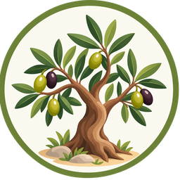

# Olivar para Home Assistant

Fichas de las parcelas de un olivar: cada parcela es un dispositivo con su variedad, sistema, marco, olivos, superficie y datos de riego.

## Instalación (HACS)
1. HACS → ⋮ → Repositorios personalizados → añade este repositorio como **Integración**.
2. Descarga **Olivar** y reinicia Home Assistant.
3. Ajustes → Dispositivos y servicios → Añadir integración → **Olivar**.

## Datos de cada parcela
Nombre, variedad, sistema, marco (entre filas × entre árboles), nº de olivos, superficie, días de riego, caudal y separación del gotero, líneas por fila, cobertura de copa y notas.

Para editarla: Ajustes → Dispositivos y servicios → Olivar → la parcela → **Configurar**.

## Sensores por parcela
Variedad (con todos los datos como atributos), Marco, Olivos, Superficie, Árboles por hectárea, Días de riego, Goteros por árbol y Caudal por árbol.
